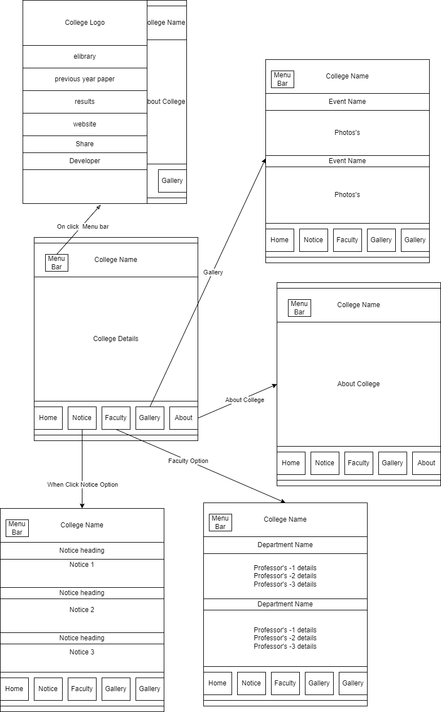
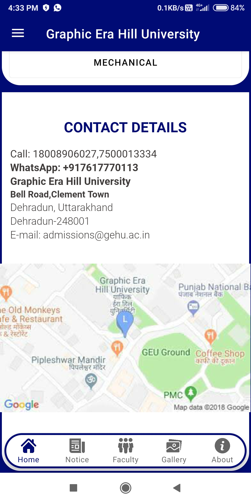
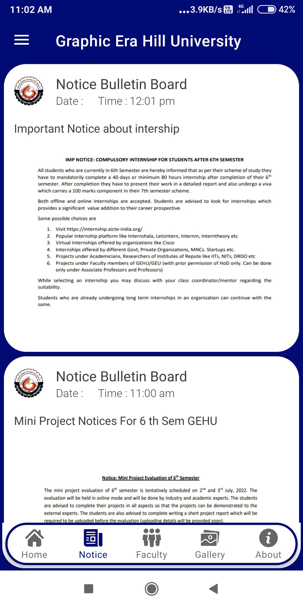
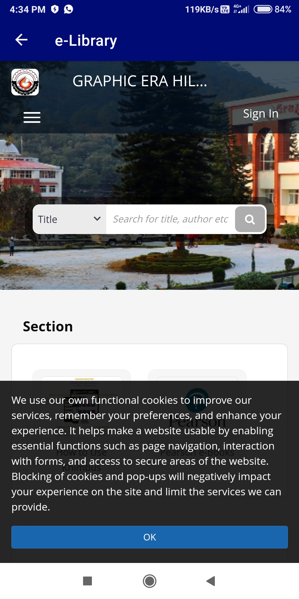
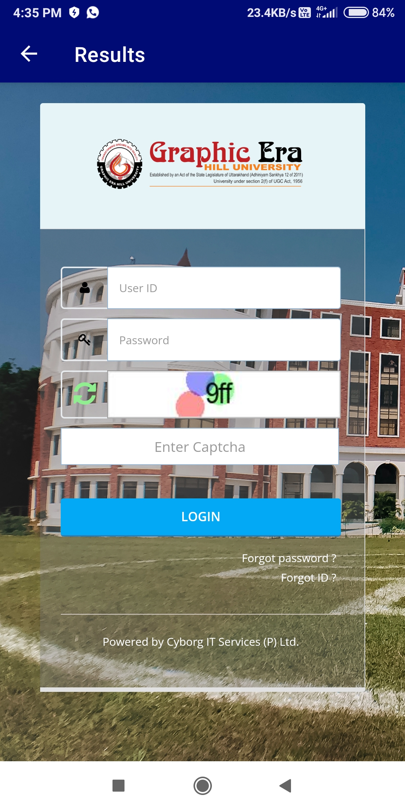
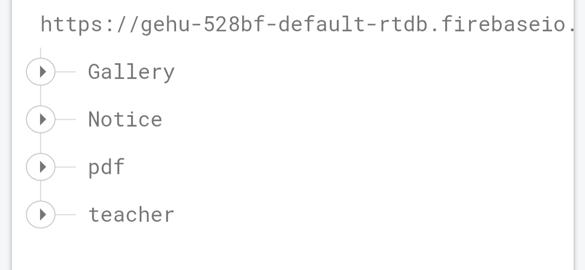
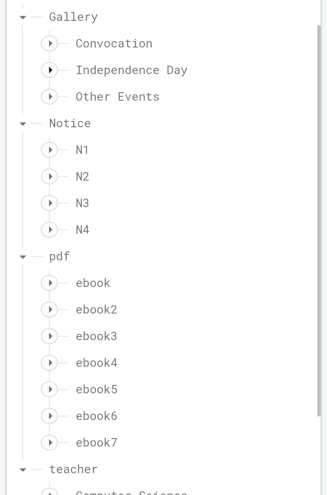

<h1 align="center">✨Gehu_APP✨</h1>

✨✨Android Application For My College Using Firebase Realtime Database.✨✨

This app is design for showing details about Graphic Era Hill University and it is my 6th semester project.
This Application is also used for connecting students. 
Students can read notices, see images, know about college ,access and read e-books provided by college, get some notes, connect to their ERP from this App.

 
<h3 align="center">✨Data Flow Diagram✨</h3>

All Screenshots of My Application
   

 
<h3 align="center">✨DataBase Structure in Firebase✨</h3>

   

